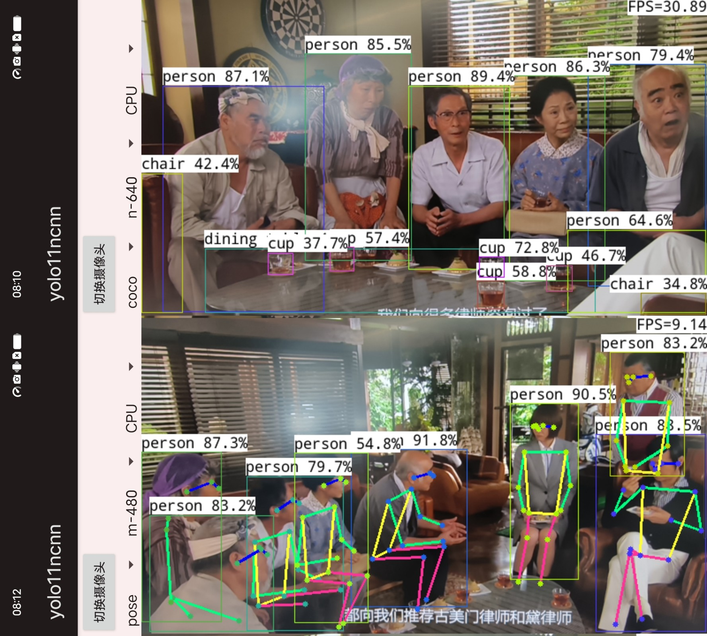
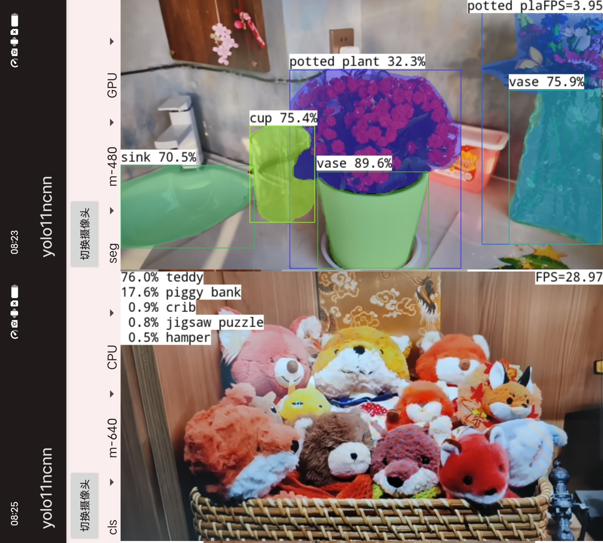
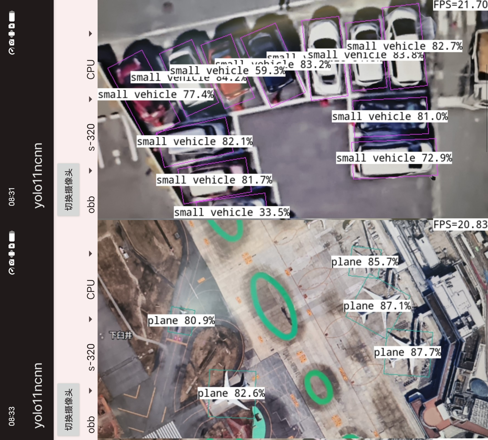

# ncnn-android-yolo11


The YOLO11 object detection

This is a sample ncnn android project, it depends on ncnn library and opencv

https://github.com/Tencent/ncnn

https://github.com/nihui/opencv-mobile

https://github.com/nihui/mesa-turnip-android-driver  (mesa turnip driver)

## android apk file download
https://github.com/nihui/ncnn-android-yolo11/releases/latest

## how to build and run
### step1
https://github.com/Tencent/ncnn/releases

* Download ncnn-YYYYMMDD-android-vulkan.zip or build ncnn for android yourself
* Extract ncnn-YYYYMMDD-android-vulkan.zip into **app/src/main/jni** and change the **ncnn_DIR** path to yours in **app/src/main/jni/CMakeLists.txt**

### step2
https://github.com/nihui/opencv-mobile

* Download opencv-mobile-XYZ-android.zip
* Extract opencv-mobile-XYZ-android.zip into **app/src/main/jni** and change the **OpenCV_DIR** path to yours in **app/src/main/jni/CMakeLists.txt**

### step3
https://github.com/nihui/mesa-turnip-android-driver

* Download mesa-turnip-android-XYZ.zip
* Create directory **app/src/main/jniLibs/arm64-v8a** if not exists
* Extract `libvulkan_freedreno.so` from mesa-turnip-android-XYZ.zip into **app/src/main/jniLibs/arm64-v8a**

### step4
* Open this project with Android Studio, build it and enjoy!

## some notes
* Android ndk camera is used for best efficiency
* Crash may happen on very old devices for lacking HAL3 camera interface
* All models are manually modified to accept dynamic input shape
* Most small models run slower on GPU than on CPU, this is common
* FPS may be lower in dark environment because of longer camera exposure time

## screenshot




## guidelines for converting YOLO11 models

### 1. install

```shell
pip3 install -U ultralytics pnnx ncnn
```

### 2. export yolo11 torchscript

```shell
yolo export model=yolo11n.pt format=torchscript
yolo export model=yolo11n-seg.pt format=torchscript
yolo export model=yolo11n-pose.pt format=torchscript
yolo export model=yolo11n-cls.pt format=torchscript
yolo export model=yolo11n-obb.pt format=torchscript
```

### 3. convert torchscript with static shape

**For classification models, step 1-3 is enough.**

```shell
pnnx yolo11n.torchscript
pnnx yolo11n-seg.torchscript
pnnx yolo11n-pose.torchscript
pnnx yolo11n-cls.torchscript
pnnx yolo11n-obb.torchscript
```

### 4. modify pnnx model script for dynamic shape inference manually

Edit `yolo11n_pnnx.py` / `yolo11n_seg_pnnx.py` / `yolo11n_pose_pnnx.py` / `yolo11n_obb_pnnx.py`

- modify reshape to support dynamic image sizes
- permute tensor before concat and adjust concat axis (permutations are faster on smaller tensors)
- drop post-process part (we implement the post-process externally to avoid invalid bounding box coordinate calculations below the threshold, which is faster)

<table>
<tr align="center"><td>model</td><td>before</td><td>after</td></tr>
<tr>
<td>det</td>
<td>

```python
v_235 = v_204.view(1, 144, 6400)
v_236 = v_219.view(1, 144, 1600)
v_237 = v_234.view(1, 144, 400)
v_238 = torch.cat((v_235, v_236, v_237), dim=2)
# ...
```
</td>
<td>

```python
v_235 = v_204.view(1, 144, -1).transpose(1, 2)
v_236 = v_219.view(1, 144, -1).transpose(1, 2)
v_237 = v_234.view(1, 144, -1).transpose(1, 2)
v_238 = torch.cat((v_235, v_236, v_237), dim=1)
return v_238
```
</td>
</tr>
<tr>
<td>seg</td>
<td>

```python
v_202 = v_201.view(1, 32, 6400)
v_208 = v_207.view(1, 32, 1600)
v_214 = v_213.view(1, 32, 400)
v_215 = torch.cat((v_202, v_208, v_214), dim=2)
# ...
v_261 = v_230.view(1, 144, 6400)
v_262 = v_245.view(1, 144, 1600)
v_263 = v_260.view(1, 144, 400)
v_264 = torch.cat((v_261, v_262, v_263), dim=2)
# ...
v_285 = (v_284, v_196, )
return v_285
```
</td>
<td>

```python
v_202 = v_201.view(1, 32, -1).transpose(1, 2)
v_208 = v_207.view(1, 32, -1).transpose(1, 2)
v_214 = v_213.view(1, 32, -1).transpose(1, 2)
v_215 = torch.cat((v_202, v_208, v_214), dim=1)
# ...
v_261 = v_230.view(1, 144, -1).transpose(1, 2)
v_262 = v_245.view(1, 144, -1).transpose(1, 2)
v_263 = v_260.view(1, 144, -1).transpose(1, 2)
v_264 = torch.cat((v_261, v_262, v_263), dim=1)
return v_264, v_215, v_196
```
</td>
</tr>
<tr>
<td>pose</td>
<td>

```python
v_195 = v_194.view(1, 51, 6400)
v_201 = v_200.view(1, 51, 1600)
v_207 = v_206.view(1, 51, 400)
v_208 = torch.cat((v_195, v_201, v_207), dim=-1)
# ...
v_254 = v_223.view(1, 65, 6400)
v_255 = v_238.view(1, 65, 1600)
v_256 = v_253.view(1, 65, 400)
v_257 = torch.cat((v_254, v_255, v_256), dim=2)
# ...
```
</td>
<td>

```python
v_195 = v_194.view(1, 51, -1).transpose(1, 2)
v_201 = v_200.view(1, 51, -1).transpose(1, 2)
v_207 = v_206.view(1, 51, -1).transpose(1, 2)
v_208 = torch.cat((v_195, v_201, v_207), dim=1)
# ...
v_254 = v_223.view(1, 65, -1).transpose(1, 2)
v_255 = v_238.view(1, 65, -1).transpose(1, 2)
v_256 = v_253.view(1, 65, -1).transpose(1, 2)
v_257 = torch.cat((v_254, v_255, v_256), dim=1)
return v_257, v_208
```
</td>
</tr>
<tr>
<td>obb</td>
<td>

```python
v_195 = v_194.view(1, 1, 16384)
v_201 = v_200.view(1, 1, 4096)
v_207 = v_206.view(1, 1, 1024)
v_208 = torch.cat((v_195, v_201, v_207), dim=2)
# ...
v_256 = v_225.view(1, 79, 16384)
v_257 = v_240.view(1, 79, 4096)
v_258 = v_255.view(1, 79, 1024)
v_259 = torch.cat((v_256, v_257, v_258), dim=2)
# ...
```
</td>
<td>

```python
v_195 = v_194.view(1, 1, -1).transpose(1, 2)
v_201 = v_200.view(1, 1, -1).transpose(1, 2)
v_207 = v_206.view(1, 1, -1).transpose(1, 2)
v_208 = torch.cat((v_195, v_201, v_207), dim=1)
# ...
v_256 = v_225.view(1, 79, -1).transpose(1, 2)
v_257 = v_240.view(1, 79, -1).transpose(1, 2)
v_258 = v_255.view(1, 79, -1).transpose(1, 2)
v_259 = torch.cat((v_256, v_257, v_258), dim=1)
return v_259, v_208
```
</td>
</tr>
</table>

- modify area attention for dynamic shape inference

<table>
<tr align="center"><td>changes</td><td>det seg pose obb</td></tr>
<tr>
<td>beore</td>
<td>

```python
# ...
v_95 = self.model_10_m_0_attn_qkv_conv(v_94)
v_96 = v_95.view(1, 2, 128, 1024)
v_97, v_98, v_99 = torch.split(tensor=v_96, dim=2, split_size_or_sections=(32,32,64))
v_100 = torch.transpose(input=v_97, dim0=-2, dim1=-1)
v_101 = torch.matmul(input=v_100, other=v_98)
v_102 = (v_101 * 0.176777)
v_103 = F.softmax(input=v_102, dim=-1)
v_104 = torch.transpose(input=v_103, dim0=-2, dim1=-1)
v_105 = torch.matmul(input=v_99, other=v_104)
v_106 = v_105.view(1, 128, 32, 32)
v_107 = v_99.reshape(1, 128, 32, 32)
v_108 = self.model_10_m_0_attn_pe_conv(v_107)
v_109 = (v_106 + v_108)
v_110 = self.model_10_m_0_attn_proj_conv(v_109)
# ...
```
</td>
</tr>
<tr>
<td>after</td>
<td>

```python
# ...
v_95 = self.model_10_m_0_attn_qkv_conv(v_94)
v_96 = v_95.view(1, 2, 128, -1) # <--- This line, note this v_95
v_97, v_98, v_99 = torch.split(tensor=v_96, dim=2, split_size_or_sections=(32,32,64))
v_100 = torch.transpose(input=v_97, dim0=-2, dim1=-1)
v_101 = torch.matmul(input=v_100, other=v_98)
v_102 = (v_101 * 0.176777)
v_103 = F.softmax(input=v_102, dim=-1)
v_104 = torch.transpose(input=v_103, dim0=-2, dim1=-1)
v_105 = torch.matmul(input=v_99, other=v_104)
v_106 = v_105.view(1, 128, v_95.size(2), v_95.size(3)) # <--- This line
v_107 = v_99.reshape(1, 128, v_95.size(2), v_95.size(3)) # <--- This line
v_108 = self.model_10_m_0_attn_pe_conv(v_107)
v_109 = (v_106 + v_108)
v_110 = self.model_10_m_0_attn_proj_conv(v_109)
# ...
```
</td>
</tr>
</table>

### 5. re-export yolo11 torchscript

```shell
python3 -c 'import yolo11n_pnnx; yolo11n_pnnx.export_torchscript()'
python3 -c 'import yolo11n_seg_pnnx; yolo11n_seg_pnnx.export_torchscript()'
python3 -c 'import yolo11n_pose_pnnx; yolo11n_pose_pnnx.export_torchscript()'
python3 -c 'import yolo11n_obb_pnnx; yolo11n_obb_pnnx.export_torchscript()'
```

### 6. convert new torchscript with dynamic shape

**Note the shape difference for obb model**

```shell
pnnx yolo11n_pnnx.py.pt inputshape=[1,3,640,640] inputshape2=[1,3,320,320]
pnnx yolo11n_seg_pnnx.py.pt inputshape=[1,3,640,640] inputshape2=[1,3,320,320]
pnnx yolo11n_pose_pnnx.py.pt inputshape=[1,3,640,640] inputshape2=[1,3,320,320]
pnnx yolo11n_obb_pnnx.py.pt inputshape=[1,3,1024,1024] inputshape2=[1,3,512,512]
```

### 7. now you get ncnn model files

```shell
mv yolo11n_pnnx.py.ncnn.param yolo11n.ncnn.param
mv yolo11n_pnnx.py.ncnn.bin yolo11n.ncnn.bin
mv yolo11n_seg_pnnx.py.ncnn.param yolo11n_seg.ncnn.param
mv yolo11n_seg_pnnx.py.ncnn.bin yolo11n_seg.ncnn.bin
mv yolo11n_pose_pnnx.py.ncnn.param yolo11n_pose.ncnn.param
mv yolo11n_pose_pnnx.py.ncnn.bin yolo11n_pose.ncnn.bin
mv yolo11n_obb_pnnx.py.ncnn.param yolo11n_obb.ncnn.param
mv yolo11n_obb_pnnx.py.ncnn.bin yolo11n_obb.ncnn.bin
```
